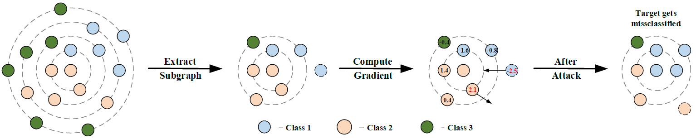

# SGA
Official implementation of Simlified Gradient Attack (SGA) in [Adversarial attack on large scale graph](https://arxiv.org/abs/2009.03488).

The Tensorflow 2.x Implementation could be found in [GraphGallery](https://github.com/EdisonLeeeee/GraphGallery).



# Update
+ 2021/3/20: add tensorflow 2.x support

# Requirements
+ TensorFlow 1.15 (it should work in `1.14`, `1.13`... and `2.x`)
+ Numpy
+ Scipy
+ tqdm

# Datasets

we only consider the largest connected component (`LCC`) of the graph for each dataset, e.g., `data/cora_lcc`.

Cora, Citeseer and Pubmed could be found in in https://github.com/danielzuegner/gnn-meta-attack,

reddit could be found in http://snap.stanford.edu/graphsage/

+ cora
+ citeseer

+ pubmed  
+ reddit

# Usage

How to attack a graph neural networks?

+ Train the surrogate model SGC
+ Generate perturbation (edge flips)
+ Attack target models with adversarial examples (SGC, GCN ...)

See `src/demp.ipynb` for a simple example to run our codes.

# Reproduce results in paper

+ Run `src/generate_edges.ipynb` to generate adversarial edges and save them, the adversarial edges can be generated by `SGA`, `GradArgmax`, `Nettack`.
+ Run `src/attack.ipynb` to test the attack performance on `SGC` and `GCN`.

# Cite

If you make use of this code or the SGA algorithm in your work, please cite the following paper:

```bibtex
@article{li2020adversarial,
  title={Adversarial attack on large scale graph},
  author={Li, Jintang and Xie, Tao and Chen, Liang and Xie, Fenfang and He, Xiangnan and Zheng, Zibin},
  journal={arXiv preprint arXiv:2009.03488},
  year={2020}
}  = {2020}
}
```

